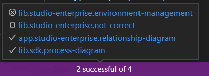

# CI Monitor

## Features

Show status for your CI plans.

## Screenshots

.

## Extension Settings

### Main
- `cimonitor.providers`: Array of providers.
- `cimonitor.jobs`: Array of jobs for providers.

### Providers
- `id`: Id of provider.
- `name`: Name of provider.
- `login`: Login.
- `password`: Password.
- `serviceUrl`: Url for ci service api.
- `type`: Type of provider.
    0 - Jenkins

### Jobs
- `id`: Id of job.
- `name`: Name for job.
- `key`: Key of project.
- `providerId`: Provider id.

### Example
```json
{
    "cimonitor.providers": [
        {
            "id": 1,
            "name": "Test Jenkins",
            "login": "Your login",
            "password": "Your password",
            "serviceUrl": "https://your-jenkins.com/",
            "type": 0
        }
    ],
    "cimonitor.jobs": [
        {
            "id": 1,
            "key": "app.studio-enterprise.relationship-diagram",
            "name": "app.studio-enterprise.relationship-diagram",
            "providerId": 1
        },
        {
            "id": 2,
            "key": "lib.sdk.process-diagram",
            "providerId": 1
        }
    ]
}
```
